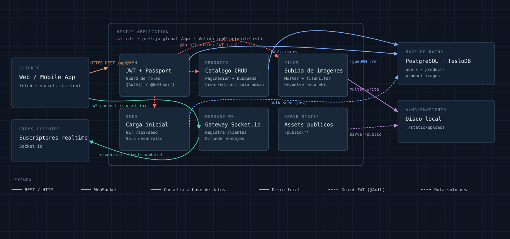

# ShoppingBE — Teslo API

API REST + WebSocket para una tienda de calzado (estilo Teslo Shoes), construida con [NestJS](https://nestjs.com/), TypeORM y PostgreSQL. Expone un catálogo de productos con imágenes, autenticación por JWT con roles, subida de archivos y un canal en tiempo real por Socket.io.

## ¿Qué hace el proyecto?

- **Catálogo de productos** (`/api/products`): alta, edición, baja, búsqueda por término/slug y listado paginado. Los productos pueden tener varias imágenes asociadas.
- **Autenticación y usuarios** (`/api/auth`): registro, login con email/password (hash con bcrypt) y emisión de JWT. Rutas protegidas por rol (`admin`, `super-user`, `user`) vía el decorador `@Auth()` y un guard propio.
- **Archivos** (`/api/files`): subida de imágenes de producto con `multer` (filtrado por extensión, nombrado con UUID) y servido posterior de esas imágenes.
- **Seed** (`/api/seed`): carga datos de ejemplo (usuarios y productos) en la base de datos. Requiere un usuario con rol `admin`, pensado solo para entornos de desarrollo.
- **Tiempo real** (WebSocket, Socket.io): un gateway que registra clientes conectados, retransmite mensajes entre ellos y notifica altas/bajas de conexión.
- **Archivos estáticos**: todo lo que se sube a disco se sirve también bajo `/public/`.

## Arquitectura



Los clientes (web/mobile) llaman a la API REST bajo el prefijo global `/api` y, en paralelo, se conectan al gateway de Socket.io para mensajería en tiempo real. Los módulos que modifican datos sensibles (`Products`, `Files`, `Seed`) están protegidos por el guard de JWT del módulo `Auth`. `Products`, `Auth` y `Seed` leen/escriben en PostgreSQL a través de TypeORM; `Files` escribe las imágenes en disco local (`./static/uploads`) y `ServeStatic` las sirve de vuelta por HTTP.

## Stack técnico

| Capa | Tecnología |
|---|---|
| Framework | NestJS 12 (Express) |
| Lenguaje | TypeScript |
| Base de datos | PostgreSQL + TypeORM |
| Autenticación | Passport + `@nestjs/jwt` (JWT), bcrypt |
| Tiempo real | Socket.io (`@nestjs/websockets`) |
| Subida de archivos | Multer |
| Validación | `class-validator` / `class-transformer` |

## Requisitos previos

- Node.js (compatible con `@types/node ^24`) y Yarn
- PostgreSQL en ejecución (local o en contenedor)

## Cómo levantarlo

1. Clonar el repositorio:
   ```bash
   git clone <url-del-repo>
   cd teslo-shop
   ```
2. Instalar dependencias:
   ```bash
   yarn install
   ```
3. Crear un archivo `.env` en la raíz con las siguientes variables:
   ```env
   DB_USERNAME=postgres
   DB_PASSWORD=<tu-password>
   DB_NAME=TesloDB
   DB_HOST=localhost
   DB_PORT=5432

   PORT=3000
   HOST_API=http://localhost:${PORT}/api/

   JWT_SECRET=<un-secreto-largo-y-aleatorio>
   ```
4. Tener una instancia de PostgreSQL corriendo y accesible con esas credenciales (la base `TesloDB` se crea/sincroniza sola gracias a `synchronize: true` en TypeORM — pensado para desarrollo, no para producción).
5. Levantar el servidor en modo desarrollo:
   ```bash
   yarn start:dev
   ```
   La API queda disponible en `http://localhost:3000/api`.
6. (Opcional) Cargar datos de ejemplo — primero registra un usuario y súbelo a rol `admin` en la base, luego llama autenticado a:
   ```
   GET /api/seed
   ```

## Scripts disponibles

| Comando | Descripción |
|---|---|
| `yarn start:dev` | Arranca en modo watch (usa `swc`) |
| `yarn start:prod` | Arranca el build de `dist/` |
| `yarn build` | Compila el proyecto |
| `yarn lint` | Lint con autofix |
| `yarn test` | Tests unitarios (Jest) |
| `yarn test:cov` | Tests unitarios con reporte de cobertura |
| `yarn test:e2e` | Tests end-to-end |

## Endpoints principales

| Método | Ruta | Auth | Descripción |
|---|---|---|---|
| POST | `/api/auth/register` | — | Crea un usuario |
| POST | `/api/auth/login` | — | Login, devuelve JWT |
| GET | `/api/auth/check-status` | JWT | Revalida el token |
| PATCH | `/api/auth/users/:id/role` | JWT (`super-user`) | Asciende/desciende a otro usuario a `admin` (no se puede cambiar el propio rol) |
| GET | `/api/products` | — | Lista paginada de productos |
| GET | `/api/products/:searchTerm` | — | Busca por id/slug/título |
| POST | `/api/products` | JWT (`admin`) | Crea un producto |
| PATCH \| DELETE | `/api/products/:id` | JWT | Edita/elimina un producto |
| POST | `/api/files/upload` | — | Sube una imagen de producto |
| GET | `/api/files/product/:imageName` | — | Sirve una imagen subida |
| GET | `/api/seed` | JWT (`admin`) | Repuebla la base con datos de ejemplo |
| GET | `/health` | — | Health check, fuera del prefijo `/api` (para balanceadores/infra) |

El WebSocket (Socket.io) se conecta directamente a la raíz del servidor (mismo host/puerto), sin prefijo `/api`.

## Documentación interactiva (Swagger)

La API expone su documentación OpenAPI/Swagger en `/api` (vía `@nestjs/swagger`).

## Novedades desde la última actualización del README

_Cambios entre el commit `48b4a35` (2026-09-05) y `3c898f9` (2026-09-17)._

- **Swagger**: documentación interactiva de la API disponible en `/api`.
- **Health check**: nuevo endpoint `GET /health`, excluido del prefijo global `/api`.
- **Gestión de roles**: un `super-user` ahora puede ascender/descender a otros usuarios a `admin` mediante `PATCH /api/auth/users/:id/role` (no puede cambiar su propio rol).
- **Fix de seed**: las contraseñas de los usuarios de seed se hasheaban en texto plano; ahora se hashean correctamente con bcrypt.
- **CI/CD**: pipeline de GitHub Actions con lint (no bloqueante), tests unitarios, tests con cobertura y build; cada push a `main` empaqueta y despliega automáticamente a AWS Elastic Beanstalk.
- **Calidad de código**: se agregaron ESLint + Prettier, tests unitarios nuevos (`auth`, `products`, `health`) y se corrigieron errores de compilación de TypeScript.
- **Dependencias e infraestructura**: actualización de librerías (`yarn.lock`), ajustes de configuración de Yarn/TypeScript para el build en AWS, y corrección del protocolo SSL.

---

_Última actualización de este README: **2026-09-17**, en base al commit `3c898f9` ("Excluyendo /health del prefijo api")._
